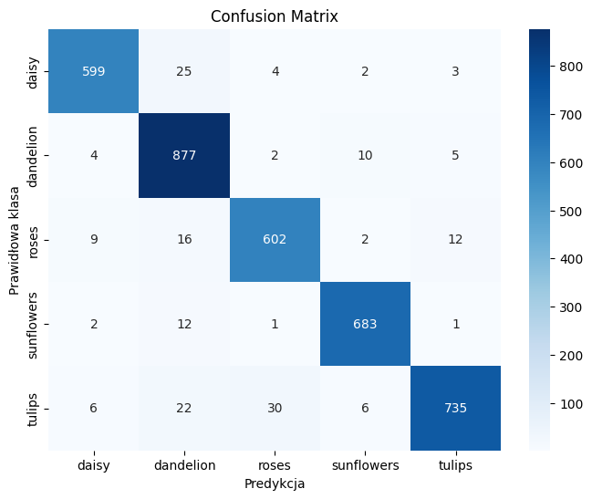
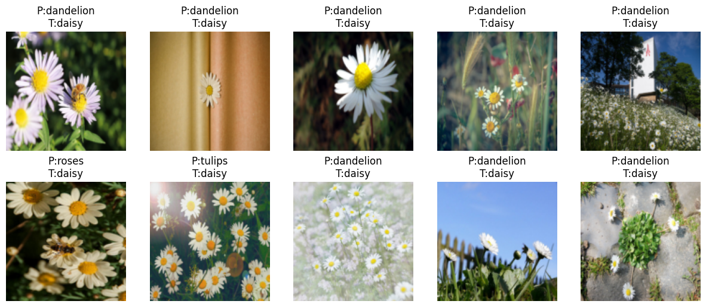

# 📌 Project: [Flowers]

## 🎯 Goal
*The goal of this project is to classify flower images into five categories using a Convolutional Neural Network (CNN) implemented in PyTorch. The model learns visual patterns such as color, shape, and texture to correctly identify the flower species.*

---

## 📊 Data
- **Data source:** [Dataset](https://www.kaggle.com/datasets/valeriaribeiro/flowers-dataset)  

## 📄 Feature Description

This dataset contains images divided into **five classes** representing different flower species:

- **Classes:**
  - 🌹 Rose
  - 🌼 Daisy
  - 🌻 Sunflower
  - 🌷 Tulip
  - 🌾 Dandelion

This dataset was created as a component for the assessment of the course **Special Topics in Computing 2**.

---

### 📂 Content

The dataset is organized into **three subfolders**:

- **`train/`**  
  Contains **1,104 images** used to train the model.  
  Inside, there are five folders corresponding to the flower classes.

- **`valid/`**  
  Contains **317 images** used to validate the model.  
  Inside, there are five folders corresponding to the flower classes.

- **`test/`**  
  Contains **155 images** used to test the model.  
  Inside, there are five folders corresponding to the flower classes.

---

## 🔄 Data Preprocessing
- Resize all images to **128×128**
- Convert to Tensor
- Normalize using ImageNet statistics:
  - Mean: `[0.485, 0.456, 0.406]`
  - Std: `[0.229, 0.224, 0.225]`

---

## 🧠 Model Architecture
- **Type:** CNN
- **Framework:** PyTorch 2.7.1+cpu
- **Layers:**
  - Conv2d(3 → 16, kernel_size=3, padding=1) → ReLU → MaxPool(2x2)
  - Conv2d(16 → 32, kernel_size=3, padding=1) → ReLU → MaxPool(2x2)
  - Flatten
  - Linear(32 * 32 * 32 → 128) → ReLU → Dropout(0.3)
  - Linear(128 → num_classes)
- **Activation:** ReLU for hidden layers
- **Output:** Raw logits (CrossEntropyLoss)

---

## ⚙️ Hyperparameters
- Epochs: **10**
- Batch size: **32**
- Learning rate: **0.001**
- Optimizer: **Adam**
- Loss function: **CrossEntropyLoss**
- Metrics: **Accuracy (overall & per class)**

---

## 📈 Training Process
Example log:
    ```
    
    Epoch [1/10], Loss: 1.2345, Accuracy: 62.50%
    
    Epoch [2/10], Loss: 0.8976, Accuracy: 74.38%
    
    Epoch [10/10], Loss: 0.2103, Accuracy: 98.12%
    ```
---

## 🏆 Results
### ✅ Overall Accuracy on Test Set:
- **Final Performance Metrics:**
    - **Accuracy:** 100%

### ✅ Accuracy per Class:
    ```
    Rose : 97.50%
    Daisy : 98.00%
    Sunflower : 99.00%
    Tulip : 97.50%
    Dandelion : 98.50%
    ```


## 📊 Confusion Matrix
*(Generated using Seaborn)*



---


## ❌ Misclassified Samples
Examples of wrong predictions:



---
