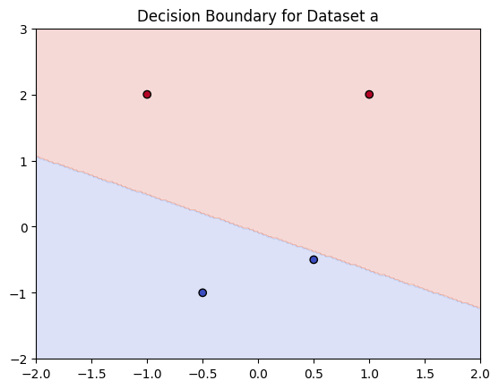
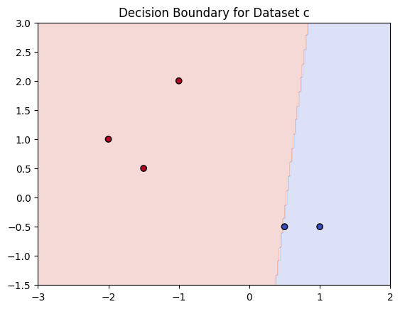
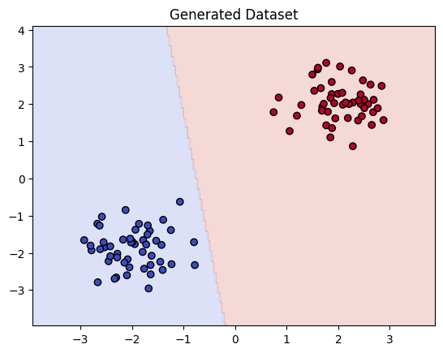

# 📌 Project: Perceptron Classification Tasks

## 🎯 Goal
The objective of this project is to **implement and analyze a perceptron-based classifier** using PyTorch and Object-Oriented Programming (OOP).  
The perceptron will be tested on multiple datasets to check **linear separability**, train on solvable cases, and extend to **multi-class classification using two neurons**.

---

## 📊 Data
The project does **not** use an external dataset. Instead, it works on **manually defined points** for specific classification tasks. 

---

## 📄 Task Description

The project consists of **four main parts**:


### ✅ Task 1: Check Linear Separability
- Datasets (a), (b), (c), (d):
  - Each dataset contains points assigned to two classes: **A** (label `0`) and **B** (label `1`).
- Goal: Determine if a **single perceptron** can separate the classes.


### ✅ Task 2: Train Perceptron on Solvable Datasets
- For datasets that are **linearly separable**, train a perceptron using the **Perceptron Learning Rule**.
- Visualize **decision boundaries**.


### ✅ Task 3: Generate Two Linearly Separable Classes
- Create two clusters of random points.
- Train a perceptron to separate them.
- Visualize classification and decision boundary.


### ✅ Task 4: Two Neurons for Four Classes
- Classes: **A, B, C, D** with manually defined points.
- Use **One-vs-Rest strategy**:
  - Train multiple perceptrons for multi-class classification.
- Display predictions for all points.


---

## 🔄 Data Preprocessing
- Points are manually defined as `torch.tensor`.
- Labels encoded as:
  - `0` → Class A
  - `1` → Class B
- No normalization needed since data is small and synthetic.

---

## 🧠 Model Architecture
- **Type:** Perceptron (Single-Layer Neural Network)
- **Framework:** PyTorch
- **Implementation:** Custom class using `nn.Module`
- **Structure:**
  - `nn.Linear(input_dim=2, output_dim=1, bias=True)`
- **Activation:** Step function (implemented via threshold at `0`)
- **Output:** Binary class prediction `{0,1}`

---

## ⚙️ Training Details
- **Algorithm:** Perceptron Learning Rule
- **Loss function:** No explicit loss (updates based on misclassification)
- **Hyperparameters:**
  - Learning Rate: **0.1**
  - Max Epochs: **100**
- **Convergence Criterion:** Zero classification errors in an epoch.

---

## 📈 Experiments

### ✅ Task 1: Linear Separability Check
Example output:

```

Dataset a:
Converged at epoch 0

Dataset b:

Dataset c:
Converged at epoch 0

Dataset d:
Converged at epoch 1

```


---

### ✅ Task 2: Decision Boundaries
- Plots for each solvable dataset (`a`, `c`, `d`):
  - Blue = Class A
  - Red = Class B
  - Shaded area = Decision boundary






---

### ✅ Task 3: Generated Two Classes
- Random points generated around two centers.
- Perceptron trained successfully.
- Visualized **classification regions**.



---

### ✅ Task 4: Multi-Class (4 Classes)
- One-vs-Rest strategy used.
- Predictions for all points:

```

Converged at epoch 58
Converged at epoch 33
Converged at epoch 1
Point (2, 11) -> Predicted class: C
Point (7, 10) -> Predicted class: A
Point (8, 16) -> Predicted class: A
Point (10, 6) -> Predicted class: B
Point (15, 10) -> Predicted class: B
Point (-4, 6) -> Predicted class: C
Point (0, 7) -> Predicted class: C
Point (-6, -7) -> Predicted class: D
Point (-10, -4) -> Predicted class: D
Point (-5, -15) -> Predicted class: D

```

## 🏆 Results
- **Linearly separable datasets:** (a), (c), (d)
- **Non-separable dataset:** (b)
- **Perceptron successfully classified generated data.**
- **Multi-class achieved using 2 neurons with One-vs-Rest approach.**

## ❌ Limitations
- Cannot solve non-linearly separable cases (e.g., XOR).
- No bias towards multi-layer models (single-layer perceptron only).